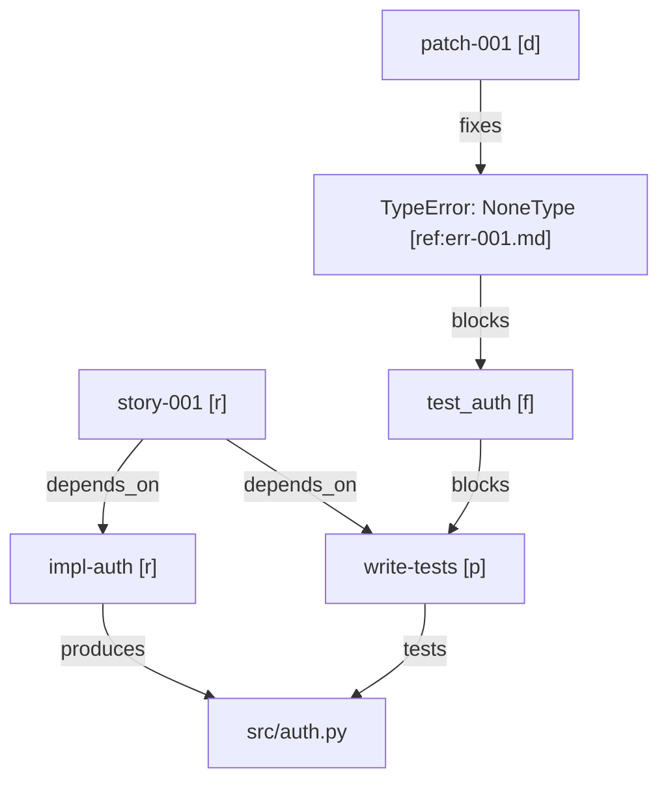

# Agentic Harness Skill

## Programmatic Train Station Thesis

Think of `agentic-harness` as the **programmatic train station** for agentic coding systems.

- OpenClaw, Claude Code, OpenCode, GitHub Copilot CLI, or similar systems are the backbone templates
- tasks, stories, and prompts are the passengers
- branches and artifacts are the platforms
- legality gates, critics, and retry policies are the signals and switchyard logic
- the harness is the stationmaster that routes traffic, prevents collisions, and
  records what actually departed and arrived

The harness is not just a wrapper around one model. It is the control layer that:

- normalizes work requests into explicit stories or scenes
- routes them to the right coding agent or subagent
- enforces policy before side effects happen
- reconciles failures into reusable repair logic
- tracks which branch, artifact, and critic state belongs to which work item

If several coding agents can enter the same project, the harness should be the
shared station contract they all pass through.

### Backbone operating model

When building a new coding harness, start from the operational backbone used by
systems like **OpenClaw, OpenCode, GitHub Copilot CLI, and Claude Code**.

Minimum backbone behaviors:

- terminal-native tool execution, not chat-only ideation
- explicit search -> inspect -> edit -> run -> verify loop
- branch or worktree awareness
- artifact and evidence production at known paths
- checkpointed plan / todo / state tracking
- critic-gated completion rather than "looks good" completion
- structured responses as the default wire format across planner / router / worker / critic / verifier boundaries
- **Critic agent ensemble option:** For difficult problems, the harness can launch an autogen set of critic agents at three sampler settings (conservative, balanced, creative). Each critic independently evaluates the candidate solution. Their feedback is aggregated and compared before finalizing changes. This option is configurable and should be enabled for high-stakes or ambiguous tasks.

### Critic Agent Ensemble Protocol

When enabled, the harness will:
1. Launch three critic agents, each with a distinct sampler setting:
   - Conservative (low temperature, strict rubric)
   - Balanced (default settings)
   - Creative (higher temperature, permissive rubric)
2. Collect structured feedback/verdicts from each critic.
3. Aggregate and disposition the feedback (e.g., majority vote, consensus, or escalate to human if critics disagree).
4. Only finalize changes if the aggregated verdict meets acceptance criteria.
5. Log all critic feedback for traceability.

This protocol is recommended for ambiguous, high-impact, or novel tasks where single-critic evaluation may be insufficient.

Extra planners, evaluators, memory layers, or multi-agent rooms can sit on top
of this backbone, but they should not replace it.

The intended stance is **dark for a specific task**: once a story or work item is
well-scoped, the harness should be able to run that task end-to-end with minimal
human interruption. The darkness is scoped to the assigned task, not treated as a
blanket license for unrestricted repo-wide autonomy.

## Structured Responses Are the Default Wire Format

Treat prose as the explanation layer, not the control plane.

Operational rule:

- every harness node should emit **one primary structured payload**
- downstream nodes should consume structured fields first and free-text summaries second
- if a node cannot satisfy the schema, return a typed error object or fail fast; do not continue on prose-shaped salvage
- bound list sizes and enum spaces in the prompt so structured outputs stay within token limits

Minimum structured surfaces:

- intake -> `TaskSpec` / task packet
- planner -> plan envelope
- router -> route decision
- worker -> action proposal or work result
- legality gate -> legality verdict
- critic -> critic verdict / checklist artifact
- verifier -> verification result
- recovery -> retry or escalation decision

The default goal is **no downstream reparsing of upstream prose** when the same
information can be carried as typed fields.

### Structured response design rules

1. use `pydantic` or an equivalent schema validator at every machine-to-machine boundary
2. keep one canonical field for the decision (`status`, `route`, `passed`, `allowed`) instead of inferring it from prose
3. carry stable identifiers (`task_id`, `story_id`, `artifact_path`, `rule_key`, `fingerprint`) rather than re-describing them
4. cap high-variance arrays explicitly (`max_structured_items`, top-k routes, top-n violations)
5. keep optional human explanation in `summary`, `reasoning`, or `notes`, but never make that the only machine-readable field

### Canonical response packet examples

```python
class ActionProposal(BaseModel):
    action_type: str
    target_path: str | None = None
    command: str | None = None
    expected_artifact: str | None = None
    confidence: float = Field(ge=0.0, le=1.0)
    reasoning: str = ""


class LegalityVerdict(BaseModel):
    allowed: bool
    violated_rules: list[str] = []
    reason: str = ""


class CriticVerdict(BaseModel):
    passed: bool
    severity: Literal["CRITICAL", "HIGH", "MEDIUM", "LOW"]
    findings: list[str] = []
    artifact_refs: list[str] = []
    summary: str = ""
```

These do not have to be the exact class names used in code. They define the
shape discipline the harness should preserve.

## Core Contract — The Coherence Flag

**Before touching any harness code**, register a coherence sentinel in SQL:

```sql
INSERT INTO todos (id, title, description, status) VALUES
  ('coherence', 'Harness coherence', 
   'All known incoherence sources resolved; pipeline completes a representative run without divergence',
   'in_progress');
```

The flag stays `in_progress` (coherence=False) until every root cause in the
**Incoherence Checklist** is cleared and a live run confirms it.  
Flip it only when the pipeline actually passes:

```sql
UPDATE todos SET status = 'done' WHERE id = 'coherence';
-- coherence = True
```

> "Did you fulfill this request?" — answer only after the todo is `done`.

---

## Compiler Mindset — State Machine Over Conversation

**Core claim:** The failure mode is not the model — it's the workflow. Treating an LLM as a chatbot invites non-deterministic sprawl. Treating it as a compiler collapses that into a single valid path.

Replace the conversational loop with: strict input → validated process → deterministic output.

Rules:
- State transitions require **external tool validation**, not AI self-assessment
- Each gate is **binary** (pass/fail), not a question posed to the model
- The AI never decides what work remains — a tool does: `while tool_says_work_remains: do_next_item`
- Concrete gates: file existence checks, linting, test presence, git diffs on protected files

### Three Compounding Failure Patterns to Design Against

| Failure | Mechanism | Countermeasure |
|---|---|---|
| Context accumulation | Output quality degrades monotonically as session grows | Sub-agents with isolated contexts; clear orchestrator regularly |
| Ambiguous directives | "fix this" / "make it better" = multiple valid interpretations; model picks arbitrarily | Every directive has a specific, verifiable target |
| AI-maintained to-do lists | Agent declares completion without proof; skips steps under context pressure | **External task tracker only** — agent marks items done via tool, tool decides what's left |

All three compound: a long session with vague prompts and self-tracked todos is near-guaranteed to drift.

### Orchestrator Context Budget

Keep the orchestrator below **50–100K tokens**. Sub-agents burn tokens on actual work and then disappear — their context evaporates; the orchestrator stays lean. If the orchestrator context is filling, the architecture is wrong, not the context limit.

### PRD Phase Discipline

The requirements/PRD step may be exploratory and conversational. Everything after it should not be. Once you know what to build, lock it down: narrow prompts, binary gates, no open-ended iteration in the execution pipeline.

---

## Relation to React Agent

Keep `agentic-harness` and `react-agent` as **adjacent but separate** skills.

- `react-agent` is the general-purpose execution loop for planning, progress,
  evidence, and multi-step delivery.
- `agentic-harness` is the specialist loop for **self-repairing automated systems**:
  legality, coherence, critic routing, retry discipline, and harness synthesis.

Recommended composition:

```text
react-agent
    -> Phase 0-2: contract, recon, plan, kanban, branch discipline
    -> delegates harness-specific execution to agentic-harness
agentic-harness
    -> diagnoses coherence failures
    -> repairs proposer / validator / critic logic
    -> returns a stable harness candidate plus coherence verdict
```

Do not collapse them into one skill unless you find repeated evidence that the
outer delivery loop and the inner harness-repair loop cannot be maintained independently.

## External Runtime Boundary

Treat external tools as substrates, not as the harness itself.

- `opencode` and `claw-code` are orchestration/runtime candidates.
- `pi` is a lightweight delegated external harness that can sit under the outer orchestrator for one bounded scene.
- `aider` is a leaf code executor that a manager or delegated harness can drive as an API-like one-shot with its own model and prompt.
- skills decide when to use a substrate; adapters decide how it is invoked.

## Integrated Runtime Stack

Do not leave the runtime boundary as dead code or test-only scaffolding.

When the harness claims to support multiple substrates, each run should resolve and
record an explicit backend stack:

- **orchestrator** — the backbone runtime for planning / interactive control
- **delegated external harness** — optional bounded child harness for one subproblem
- **leaf agent** — the narrow code executor for manager-issued one-shot work

Minimum integration standard:

1. resolve the selected runtime adapter from configuration
2. bind it to a concrete model-registry endpoint
3. render an invocation or provider patch through the adapter layer
4. serialize the resolved stack into run state, logs, or CLI output

Current working default:

- `opencode` for the orchestrator lane
- `pi` for the delegated external-harness lane when the outer manager wants a second lightweight harness
- `aider` for the leaf-agent lane

This keeps the stack inspectable and prevents "backend support" from meaning
"a helper module exists somewhere with unit tests."

## Default Agent Settings

Canonical behavioral hyperparameters live in `default_agent_settings.json`
(same folder as this skill). All harness applications — `deep-research`,
`react-agent`, and any future harness sub-skill — load this file as their
baseline and override only what diverges from the defaults.

```json
// agentic-harness/default_agent_settings.json
{
  "retrieval_depth": 5,
  "reranking": "llm_judge",
  "context_budget": 512,
  "planning_depth": 1,
  "verification_passes": 0,
  "temperature": 0.0,
  "top_p": 0.9,
  "frequency_penalty": 0.7,
  "abstention_policy": "exclude_if_low",
  "response_format": "structured",
  "schema_strict": true,
  "max_structured_items": 10
}
```

| Param | Default | What it controls |
|---|---|---|
| `retrieval_depth` | 5 | ReAct iterations — think→act→observe loops; agent gets 4 analysis steps before the final answer |
| `reranking` | `llm_judge` | After multi-step analysis, a synthesis call reconciles accumulated steps before output; `"none"` skips |
| `context_budget` | 512 | Chars of prior-step analysis carried into each next step; 0 = stateless, 2048 = full memory |
| `planning_depth` | 1 | CoT steps inside the final JSON call; 1 = single-shot answer generation |
| `verification_passes` | 0 | Self-critique loops after the answer; 0 = no second-guessing |
| `temperature` | 0.0 | Sampling entropy; 0 = deterministic/greedy |
| `top_p` | 0.9 | Nucleus sampling cutoff; prunes the bottom 10% probability mass |
| `frequency_penalty` | 0.7 | Suppresses token repetition; prevents re-selecting the same tokens across steps |
| `abstention_policy` | `exclude_if_low` | Low-confidence picks are dropped from the final selection rather than included |
| `response_format` | `structured` | Default response mode for node-to-node handoffs; prose may accompany it but should not replace the schema |
| `schema_strict` | `true` | Reject or retry malformed structured outputs instead of silently salvaging partial content |
| `max_structured_items` | 10 | Prompt-side cap for high-variance arrays such as findings, routes, or proposals |

### Choosing `retrieval_depth`

Select `retrieval_depth` using if/then/else conditions **before** the run starts, not after evidence gaps appear mid-execution.

```
IF task = single well-defined lookup (find X, what is Y)        → retrieval_depth = 3
IF task = moderate complexity (multi-file, unclear scope)        → retrieval_depth = 5 (default)
IF task = multi-hop reasoning / synthesis / long horizon         → retrieval_depth = 8+
ELSE (scope ambiguous)                                           → ask: "How thorough should this be —
                                                                   quick scan (3), standard (5), or
                                                                   exhaustive (8+)?"
```

Contingencies to record before dispatch:
- If early iterations surface contradictions or evidence gaps, raise `retrieval_depth` before final synthesis — not after.
- If iterations exhaust without convergence, surface the unresolved subquestions rather than generating a speculative answer.
- If the user stated a time/cost constraint, cap `retrieval_depth` at the constraint ceiling and flag what was skipped.

**Loading pattern (Python):**

```python
import json
from pathlib import Path

HARNESS_DIR = Path(__file__).parent  # or absolute path to agentic-harness/
DEFAULT_SETTINGS = json.loads((HARNESS_DIR / "default_agent_settings.json").read_text())

def get_agent_settings(**overrides) -> dict:
    """Return merged settings: defaults + caller overrides."""
    return {**DEFAULT_SETTINGS, **overrides}
```

Sub-skills call `get_agent_settings()` with only the keys they need to change.
The defaults are the contract; overrides are the exception.

## Repo Mirror Guidance

When this skill is mirrored into a project repository, keep the repo copy
compact and separate:

- `prompts/skills/agentic-harness/agentic-harness.md` for the full local mirror
- `prompts/skills/agentic-harness/agentic-harness.llm.md` for selector injection
- keep the agent-only routing policy explicit unless you intentionally change it

## Exportable Generalization

The source of truth is this global skill. Keep it general enough that a repo copy
can be exported without rethinking the contract.

- restate the task as objective, wedge, failure modes, and completion artifact
- keep a visible review ladder: office-hours → CEO review → eng review → design review → QA → ship → retro
- preserve the scope boundary before any side effect
- fix mechanisms, not one-off outputs
- require artifact-backed completion, not log-shaped optimism
- keep autonomy inspectable from orchestration code
- use the repo mirror only as a downstream export target

## No Band-Aid Repair Rule

This skill is explicitly **anti ad-hoc repair**.

- Do not patch only the current generated artifact if the defect comes from the
  proposer, validator, critic, retry policy, or state contract.
- Fix the mechanism that produced the defect class.
- A repair only counts when it suppresses the failure mode on:
  1. a minimal isolated reproduction
  2. a representative full harness run

If the only way to "fix" the system is to hand-edit each bad output, the harness
is still incoherent.

## Silent Bounded-Edit Stall Protocol

Treat a bounded edit run as a **dead-end stall**, not "still working", when all of
the following are true after one short wait window or one bounded retry:

- the task is a bounded edit packet, not a known long-running job class
- there is no stdout or materially informative progress signal
- there is no file diff or other mutation evidence
- there is no interactive or steerable intermediate state

Protocol:

1. preserve any discovered source-of-truth, family shape, or acceptance criteria
2. terminate the stalled run instead of waiting indefinitely
3. escalate to the next permitted repair path:
   - tighter reprompt with the exact source-of-truth and acceptance criteria
   - if still silent, supervised/manual patch or alternate agent path
4. record the stall as a harness failure class rather than treating it as user or
   artifact failure

Do not apply this rule to legitimate long-running work such as installs, builds,
large test suites, or broad data jobs that have an expected runtime profile or
continue emitting meaningful progress.

This rule exists for **bounded edit runs with no observable progress**, not for
generic slow jobs.

## Hierarchical Repair-Surface Selection

When the user brings a broken downstream artifact as evidence, first ask which
layer actually owns the failure class.

- If the repeated defect is in routing, orchestration, sampler policy, retry
  policy, shell selection, or context discipline, the fix belongs at the
  **harness / orchestrator layer**.
- Use the downstream artifact only as a **proxy test** for the higher layer.
  The artifact is the unit test input/output surface, not necessarily the place
  where the repair lives.
- A proxy artifact is valid when it is cheap to rerun, deterministically exposes
  the orchestration bug, and gives a binary pass/fail signal after the harness
  change.
- Do not confuse "the artifact that failed" with "the layer that should be
  edited." The artifact may be only the witness.
- Prefer harness-as-code, parser, generator, orchestrator, or policy fixes over
  hand-editing downstream artifacts.
- Allow a narrow downstream edit only when:
  1. the higher-level generator/parser path is unavailable or itself broken
  2. the downstream artifact is the explicit repair target
  3. a narrow unblock is required and the higher-level fix is not yet ready

Example:

- repeated `bash` vs `cmd /c` dithering while troubleshooting `spec_dec.bat`
  is a harness/orchestrator failure
- `spec_dec.bat` is the downstream proxy artifact that proves whether the
  orchestrator now takes the first grounded action and surfaces the real error

This is the hierarchy rule:

1. identify the highest layer that can eliminate the whole failure class
2. patch that layer
3. rerun the proxy artifact as the regression test
4. only patch the artifact itself when a remaining concrete artifact-local error
   still exists after the harness fix

Cross-reference: `debugging` owns the general root-cause / layer-isolation
method. `agentic-harness` owns the harness-specific case where the orchestrator,
retry policy, or pipeline contract is the real defect surface.

## Artifact-Backed Coherence Gate

Coherence is not true just because logs look better.

Before flipping the coherence flag, confirm that:

- the expected artifact exists at a known path
- the artifact was produced by the repaired pipeline, not by manual patching
- the artifact can be reopened and inspected after the run
- the artifact satisfies the task-specific completion condition

## Autonomy Should Be Inspectable from Code

Do not treat autonomy as a vibe or a marketing label. Treat it as a property of
the **orchestration code**.

When reviewing a harness, inspect:

- how much task decomposition happens without a human turn
- how much decision authority is delegated to workers
- what monitoring hooks exist
- where intervention points still exist
- whether approval nodes protect irreversible actions

Use a simple code-inspection lens:

```text
assess_autonomy(code):
    orchestration = extract_orchestration_logic(code)
    impact = score_task_and_decision_independence(orchestration)
    oversight = score_monitoring_and_intervention_points(orchestration)
    return weighted_autonomy_score(impact, oversight)
```

Operational rule:

- higher autonomy requires **more explicit oversight**, not less
- if impact rises while intervention points disappear, the harness is becoming reckless
- inspect the orchestration graph before trusting a "fully autonomous" claim

---

## AutoHarness Thesis — Learn the Harness, Not Just the Prompt

AutoHarness (arXiv:2603.03329) matters because it validates a stronger pattern than
"retry the prompt until it behaves":

- the agent should **write or refine code around itself**
- the environment should act as the **critic**
- legality should be checked by **verifiable code**, not only by model intuition

The paper's core result is that a smaller model with a synthesized harness can
outperform a larger unharnessed model. The transferable lesson is not "use games";
it is: **if the environment has hard rules, move those rules into code and refine
that code from live failures**.

## Orchestration Patterns to Carry Forward

These patterns are in scope for this skill and should be used explicitly when they fit.

### LangGraph pattern

Use a LangGraph-style architecture when you need:

- explicit typed shared state
- named nodes with stable contracts
- router / supervisor nodes
- bounded loops with counters in state
- checkpointed recovery between turns
- human-review or approval nodes

Default node set for a software harness:

- planner
- router
- implementer
- executor
- critic
- verifier
- recovery / retry
- human-review

State should carry:

- current objective
- current story or scene id
- current branch
- artifact paths
- retry counters
- critic findings
- coherence status

### Operating modes

Support two explicit operating modes:

- **semi-autonomous** - workers advance until a checkpoint, then pause for review
- **fully autonomous** - workers continue without a human checkpoint, but only
  inside a verified envelope with strong monitoring

For dark-factory use, prefer **fully autonomous for the current task** once the
story, artifact target, and guardrails are explicit.

Default checkpoint triggers:

- destructive file operations
- dependency installation or environment mutation
- branch merge or deployment
- low-confidence critic verdicts
- novelty or ambiguity that changes the project plan

Do not let a harness drift between these modes implicitly. The current mode
should be named in state and visible in logs.

### Anthropic agentic orchestration patterns

Treat the following as canonical patterns:

- **Prompt chaining** — linear stage-by-stage transformations
- **Routing** — classify work, then send to the right specialist
- **Parallelization** — fan out independent workers, then reduce
- **Orchestrator-workers** — one coordinator delegates subproblems
- **Evaluator-optimizer** — critic loop that scores and refines outputs

Mapping to harness work:

- prompt chaining -> multi-stage codegen pipeline
- routing -> choose planner / coder / test-writer / repair path
- parallelization -> run multiple candidate harnesses or rollouts
- orchestrator-workers -> PM / implement / verify split
- evaluator-optimizer -> reconcile / critic / fix loop

### Evaluation stack: checklist + DSPy + TextGrad

Treat harness evaluation as a **stack of complementary patterns**, not one generic
"judge" blob.

- **`checklist`** — schema-bound artifact audit. Best when you need structured
  findings, novelty proof, and a reviewable JSON artifact.
- **DSPy-style evaluation** — metric / reward-first optimization. Best when you
  can score a module, pipeline step, or candidate program explicitly and want
  trace-aware compile / refine loops.
- **TextGrad-style evaluation** — natural-language loss and textual-gradient
  optimization. Best when the evaluator must explain *how* to improve text,
  code, or prompt artifacts and deterministic scalar metrics are incomplete.

Operational rule:

1. prefer an explicit metric or reward function when one exists
2. add textual feedback when the metric alone does not say what to change
3. keep optimizer output as intermediate evidence, not final acceptance
4. gate completion on the reopened artifact and verifier, not on optimizer score alone

For DSPy-derived patterns, the main portable pieces are:

- `program + metric + trainset -> compiled candidate`
- trace filtering from high-scoring runs
- `BestOfN` / `Refine` reward-threshold loops
- explicit `fail_count` / error-budget handling

Prefer the modern `Refine` / `BestOfN` framing over the deprecated
`Assert` / `Suggest` framing when describing evaluation retry policy.

For TextGrad-derived patterns, the main portable pieces are:

- natural-language `loss_fn` / evaluator instructions
- separate forward model and backward / critic model
- textual-gradient updates over mutable artifacts
- saved trajectory / loss-history for inspection
- multi-seed or majority-vote hygiene when objectives are noisy

If the harness evaluates generated code, keep the TextGrad lesson explicit:
untrusted code should run only inside a robust sandbox, and evaluation writeups
should record instability rather than hiding it.

### AutoGen pattern

AutoGen-style multi-agent chat is appropriate when role conflict is useful, not decorative.

Useful roles:

- product manager
- planner
- coder
- code critic
- tool executor
- verifier
- repo steward

If using group chat / chat room capability:

- cap rounds explicitly
- define termination conditions up front
- keep the code critic independent from the coder
- require artifact output, not just conversation consensus
- have one manager agent decide when a discussion ends and work product is accepted

The point of a chat room is perspective separation, not theatrical dialogue.

### Canonical split

Treat a harness as three separable responsibilities:

```python
def propose_action(state) -> ActionProposal:
    ...

def is_legal_action(state, action: ActionProposal) -> LegalityVerdict:
    ...

def critique_transition(state, action: ActionProposal, env_feedback) -> CriticVerdict:
    ...
```

- `propose_action` picks a candidate move / patch / command
- `is_legal_action` enforces rule validity before commitment
- `critique_transition` consolidates environment failure into a repair signal
- all three should exchange typed payloads, not freeform prose blobs

For software harnesses, "action" can mean:
- shell command
- file patch
- generated import / dependency choice
- next pipeline transition

---

## Harness Synthesis Loop

When the task is not just to debug a harness but to **build one automatically**,
use this loop:

1. Start from a minimal harness skeleton
2. Run it in the real environment
3. Stop the rollout immediately on illegal action, execution failure, or invalid state transition
4. Sample a small set of concrete failures
5. Consolidate them into a critic report
6. Refine the harness code, not just the prompt
7. Keep multiple harness candidates alive when exploring different control structures
8. Promote the candidate with the best legality rate / reward

### Search policy

AutoHarness uses tree search with Thompson sampling over code hypotheses. The
important operational point is:

- do not refine a single brittle harness forever
- keep several competing harness variants
- balance exploration (new logic) against exploitation (repairing the current best)

For day-to-day engineering, a simpler equivalent is acceptable:
- maintain 2-4 materially different harness candidates
- score them on legality first, then reward / usefulness
- kill candidates that repeat the same failure mode

### Archive-driven discovery

Keep an archive of prior harness candidates, not just the current best attempt.

Minimum archive contents:

- candidate id
- control structure summary
- benchmark or story set used
- legality / trust / completion metrics
- critic report
- artifact path
- failure class labels

Promotion rule:

- only promote a candidate into the archive if it beats the incumbent on the
  benchmark suite or introduces a materially different control structure worth keeping

The point is to let the station learn from previous harnesses instead of
re-deriving the same loops every session.

### Failure sampling

The paper's setup is a good default pattern:
- run multiple environments in parallel
- cap rollout length
- sample only a few failed steps for refinement
- train until legality reaches 1.0 or the budget is exhausted

The point is to feed the refiner **high-signal failures**, not every log line.

---

## Harness Progression Ladder

AutoHarness suggests three increasing levels of control:

### 1. Harness-as-action-verifier
- let the LLM propose an action
- reject it if `is_legal_action(...)` fails
- re-prompt with an explicit illegal-action warning

Use this first. It is the lowest-friction upgrade over a raw agent.

### 2. Harness-as-action-filter
- code enumerates or narrows legal candidates
- the LLM ranks or selects among them

Use this when the action space is structured and legality can be enumerated.

### 3. Harness-as-policy
- code directly chooses the next action
- no LLM call is required at execution time

Use this only after legality is stable and the task is repetitive enough that the
policy can be distilled into code.

Rule of thumb:
- verifier -> when the model is smart but sloppy
- filter -> when the legal set is derivable
- policy -> when the task is narrow, repeated, and testable

---

## Refinement Rules from Environment Feedback

Preserve the split between proposer bugs and validator bugs.

- If `is_legal_action(...)` says **legal** but the environment rejects the action:
  - refine **both** proposer and validator
- If `is_legal_action(...)` says **illegal** and the environment also rejects it:
  - refine the **proposer** first
- If actions are legal but reward is poor:
  - legality is solved; optimize policy quality separately

Do not mix these failure classes together. A harness that confuses legality with
strategy becomes harder to repair.

### Heuristic ordering

Optimize in this order:

1. illegal-action rate
2. execution reliability
3. task reward / output quality

A clever policy with illegal actions is not a policy. It is noise with moments of success.

---

## AutoHarness Core Methods — Pseudocode

Use these as the concrete reference pattern when implementing automatic harness
learning rather than manual one-off fixes.

### 1. Harness synthesis via tree search

```text
Initialize tree with root node containing empty/template code

WHILE timeout not reached:
    node = Thompson_sample(tree)

    rollout_results = run_parallel_envs(node.code, n=10, max_steps=1000)

    failed_steps = collect_failures(rollout_results, max=5)
    # illegal action, exception, wrong format, invalid transition

    new_code = Refiner(
        base_code=node.code,
        failed_steps=failed_steps,
        env_desc=environment.description,
        action_space=environment.action_space,
    )

    new_node = tree.add_child(parent=node, code=new_code)

    heuristic = eval_legal_action_rate(new_code, test_rollouts=1000)
    update_node_stats(new_node, heuristic)

    IF heuristic == 1.0:
        RETURN new_code
```

### 2. Thompson sampling node selection

```text
FOR each node in tree:
    alpha = node.wins + 1
    beta = node.trials - node.wins + 1
    node.sample = draw Beta(alpha, beta)

RETURN argmax(node.sample for node in tree)
```

Why this matters:
- early low-trial nodes remain explorable
- search does not collapse to one brittle path too early
- partial successes can still compete with the current best candidate

### 3. Harness-as-action-verifier inference loop

```text
FUNCTION agent_step(observation):
    action = propose_action(observation)

    IF is_legal_action(observation, action):
        RETURN action
    ELSE:
        action = LLM(
            observation,
            warning="previous action was illegal: " + action,
        )
        RETURN action
```

### 4. Refiner prompt logic

```text
FUNCTION Refiner(base_code, failed_steps, env_desc, action_space):
    FOR each failed_step in failed_steps:
        analyze state
        identify violated rule or contract
        reason about the fix

    reason about loop-avoidance and fallback behavior

    new_code = LLM(
        system="python programmer, environment expert",
        context=[env_desc, action_space, failed_steps, base_code, signatures],
        rules=[
            no broad try/except,
            satisfy all observed states,
            fix all current errors,
            prefer safe executable code,
            add tie-breaking / random fallback only where needed,
        ],
    )

    RETURN new_code
```

### 5. Harness-as-policy reward heuristic

```text
FUNCTION compute_heuristic(trajectory):
    IF illegal_action_taken:
        RETURN 0
    ELSE:
        r = environment_reward(trajectory)   # sparse reward in [0, 1]
        RETURN 0.5 + 0.5 * r
```

This keeps legality as a hard floor:
- illegal trajectories score `0`
- any legal zero-reward trajectory still beats an illegal one
- reward optimization only starts after validity is preserved

### 6. Refinement routing

```text
result = execute_step(state, code)

IF is_legal_action() returned True AND environment rejected action:
    refine BOTH propose_action() AND is_legal_action()

ELIF is_legal_action() returned False AND environment confirms action was illegal:
    refine ONLY propose_action()
```

### Working premises

- [observed] harness synthesis should search over a **tree of code hypotheses**, not only flat iterative prompting
- [observed] the refiner should receive **state + action + error**, not just an error string
- [observed] `propose_action` and `is_legal_action` should be separable and repairable independently
- [inferred] Beta priors keep underexplored nodes alive long enough to discover better harness structures
- [inferred] the `0.5 + 0.5r` heuristic preserves legality as a strict constraint before reward optimization

---

## Incoherence Checklist

Work through these in order; each is a potential root cause for a harness that
produces degraded or diverging output.

### 1. Sentinel objects fed back to the LLM
- Never return a sentinel dict (e.g. `{"kind": "ParseError", ...}`) from a
  parse function and pass it to a downstream LLM call.
- The LLM treats the sentinel as content and generates responses around it,
  creating new files / new import chains → violation count grows each round.
- **Fix**: return `[]` / `{}` / `None` on parse failure; log a warning instead.
  Do **not** salvage truncated JSON — see #3 for the correct upstream fix.

### 2. Gate timeouts as false negatives
- Long-running shell commands in gates (e.g. `pip install -e .`) take 30-40 s
  to *fail* when the target file doesn't exist.  Combined with an OR chain they
  can exceed the gate timeout and return exit=-1.
- **Fix**: guard expensive operations behind file-existence checks:
  ```bash
  ([ -f pyproject.toml ] || [ -f setup.py ]) && pip install -e '.[dev]' -q \
    || pip install -r requirements.txt -q 2>/dev/null || true
  ```
- After fix, measure: gate that took 83 s → 1.2 s.

### 3. LLM output truncation mid-structure
- At `max_completion_tokens=4096`, the LLM truncates mid-JSON.
- **Root cause**: the audit/fix prompt asks the LLM to enumerate all violations with no count limit.  The response overflows the token cap, the JSON is malformed, and the parser either silently drops data (salvage) or raises — either way the next round starts with corrupted input.
- **Fix — bound at the prompt, not the parser**:
  - Add `LIMIT: Report at most 10 violations.` to the audit prompt.
  - 10 violations × ~100 tokens each ≈ 1000 tokens — comfortably within the 4096 cap.
  - In the parser, call `json.loads` directly and let it raise on malformed JSON.  A hard failure surfaces the problem immediately rather than hiding it behind partial data.
- **Do not use a salvage parser** (`rfind("}")` + slice).  Salvage masks token-cap overflows, silently drops violations, and causes the audit loop to believe it is making progress when it is not.
- Always validate completeness with an EOF sentinel (`# END OF FILE`) for generated code files, but for structured JSON responses prefer prompt-side bounds over post-hoc repair.

### 4. Violation-count divergence (getting worse, not better)
- Symptom: violations grow round-over-round (6 → 14, or 7 → 12 → 26).
- **Primary trigger (most common)**: audit LLM hits token cap mid-JSON — see #3.  The truncated response is misread as fewer violations than actually exist, so the fix pass targets the wrong things and introduces new problems.  Fix #3 first.
- **Secondary trigger**: sentinel objects fed back as content — see #1.
- **Tertiary trigger**: the LLM introduces new imports/files to fix existing violations, creating a cascade.
- **Distinguish import violations from LLM-reported violations**:
  - Import violations (from actual Python import attempts) are authoritative.
  - LLM-reported NameErrors / style issues are advisory; treat as soft.
- Hard-stop after `MAX_ROUNDS` and pass residual violations forward rather than
  cycling forever.  Residual LLM-only violations are usually false positives.

### 5. Test generation producing empty output
- Symptom: `generate_tests` discards all files; 0 test files written.
- Common cause: the generated source has broken imports (pygame, cv2, etc.)
  that cause `CollectionError` at pytest collection time.
- **Fix options**:
  - Have tests use inline stubs rather than importing real modules.
  - Inject `SDL_VIDEODRIVER=dummy DISPLAY=:99` before collection.
  - Generate a `conftest.py` that mocks heavy deps before any import.
- Continuation limit: if a test file generation hits 5 continuation turns and
  still has a `SyntaxError`, discard and move on; don't block the pipeline.

### 6. Full pipeline retry vs. targeted fix
- Pipeline retry on gate failure triggers full re-implementation (expensive).
- Before accepting a retry, confirm the gate failure is a *real* code defect,
  not a harness timing/tooling issue (see #2).
- Fix the harness first; only then let the pipeline retry the generated code.

---

## Observability Pattern for Long-Running Harness Runs

```bash
# Start
nohup python -m dark_factory "prompt" --output /tmp/gendir > /tmp/run.log 2>&1 &
echo "PID $!"

# Monitor
tail -f /tmp/run.log

# Key log signals to watch for:
# GOOD:  "reconcile_audit round N: M violation(s) (K from import check)"  — K decreasing
# GOOD:  "generate_tests: N files"                                         — N > 0
# GOOD:  "gate install_deps: exit=0"
# BAD:   "reconcile_audit round N: M violation(s) (0 from import check)"  — M growing
# BAD:   "ReadTimeout on attempt N" × 3+                                  — server overloaded
# BAD:   "Test for X truncated at turn 5" / SyntaxError                   — test discard
# BAD:   "gate install_deps: exit=-1"                                      — gate timeout bug
```

**ReadTimeout handling**: `MAX_RETRIES=4`, backoff `[2, 5, 10, 20]` seconds.
Silence in the log after a retry message = generation in-flight (not hung).
DEFAULT_TIMEOUT = 300 s per attempt.  A 216-second generation is slow but valid.

---

## Secure Execution Envelope

If the harness performs real software work, give it a controlled execution
envelope rather than raw host access.

Minimum envelope:

- isolated worktree, container, or sandboxed repo copy
- mounted codebase or bounded workspace path
- explicit security guardrails on commands, files, and network access
- static analysis tools available to the critic / verifier layer
- audit logs for actions, errors, security events, and outputs

Security loop:

```text
while run_active:
    monitor_for_unauthorized_access()
    monitor_for_data_leakage()
    verify_workspace_integrity()
    if security_issue_detected:
        isolate_run()
        emit_security_report()
        route_to_recovery()
```

Do not call a system "autonomous" if it is only autonomous because it was given
unsafe unrestricted access.

### Trust gate for generated code

The verifier should aggregate multiple analysis tools into a trust pass, not rely
on one model's confidence.

Minimum trust inputs:

- tests
- static analysis
- lint or type checks when available
- security scan or policy checks
- dependency / import reality checks

Use trust as a gate for acceptance, not as a substitute for artifact-backed verification.

### Hallucination control

Treat hallucinations in repository-level codegen as a tracked failure class.

Useful buckets:

- invented imports or APIs
- nonexistent files, modules, or symbols
- false assumptions about repo structure
- security or policy violations

Mitigation order:

1. improve retrieval and context grounding
2. improve verifier / critic detection
3. only then retry generation

---

## Sub-Skills

This skill has the following sub-skills. Invoke the relevant sub-skill when the task falls in its domain:

| Sub-skill | File | When to invoke |
|---|---|---|
| `deep-research` | `~/.copilot/skills/deep-research/SKILL.md` | Task requires web evidence gathering, multi-source corroboration, or report generation before/alongside harness work |

---

## Dark Software Factory — Specific Internals

These apply to the `dark_factory` harness at `/home/user/harness`:

| Constant | File | Value | Notes |
|---|---|---|---|
| `_MAX_ROUNDS` | `reconcile.py:23` | 4 | Fix+audit cycles; round counter is 0-based internally, displayed 1-based |
| `_SNAPSHOT_CHARS` | `reconcile.py:24` | 32 000 | Source fed to audit/fix LLM; fills most of 48K context for large projects |
| `GATE_TIMEOUT` | `gates/runner.py:14` | 120 s | Gate shell command hard cap |
| `MAX_RETRIES` | `llm.py:308` | 4 | LLM HTTP retries before raising |
| `DEFAULT_TIMEOUT` | `llm.py:49` | 300 s | Per-attempt HTTP timeout |

**Pipeline flow**: PM → implement → reconcile (audit/fix loop) → generate_tests → install_deps gate → verify → [retry ×3]

**LLM tiers**:
- `heavy` → `local-qwen` (Qwen3.6-35B-A3B, 127.0.0.1:8081, ~15-20 tok/s, 4096 max out)
- `fast`/`standard` → `copilot-proxy` (192.168.3.122:8069, gpt-4o / gpt-4.1 / claude-sonnet-4)

**Reconcile route logic** (`reconcile.py:231`):
```python
if state["violations"] and state["round"] < state["max_rounds"]:
    return "fix"   # continue loop
return END         # pass residuals to verify
```
Note: `round` increments *after* fix, so 4 fix passes happen before the `< 4` guard closes.

**Test stub pattern**: tests use inline class stubs, not real `src.*` imports.
This avoids pygame `ImportError` at collection time but means test coverage
of the real implementation requires a separate integration pass.

**Structured TaskSpec input**: `regression_run.py` accepts a JSON file path or inline JSON object in place of a plain idea string.  `_resolve_input()` detects format in order: `.json` file path → inline `{...}` string → plain idea string.  When a `TaskSpec` is detected it is parsed with pydantic and serialised to a Markdown requirements document via `task_spec_to_idea()` before entering the pipeline — all downstream nodes see the enriched Markdown.  The raw JSON is preserved in `state["task_requirements"]` for programmatic inspection.

Treat `TaskSpec` as the intake example of a broader rule: once a task enters the
harness, planner, router, critic, verifier, and recovery nodes should keep
passing schema-bound payloads in state rather than forcing later nodes to
reconstruct intent from prose summaries.

`TaskSpec` fields:
- `title` / `project_name` — human label vs directory slug
- `datasets`, `data_fields` — HuggingFace or local datasets to use
- `libraries` — `LibrarySpec(name, install, purpose)` objects
- `behaviors` — ordered list of what the code must do
- `constraints` — hard non-negotiable rules (get their own section heading)
- `llm_output_schema` — `LLMOutputField(key, field_type, required, description)` for structured LLM outputs
- `acceptance_criteria` — verifiable pass/fail statements
- `output_format` — free-text description + pydantic model definitions

Schema lives at `dark_factory/schemas/task_spec.py`.

---

## Dark Software Factory Delivery Model

Beyond the internal reconcile loop, keep the **project-management mentality** explicit.

### Kanban from the project plan

Translate the project plan into story cards with at least:

- story id
- objective
- acceptance condition
- current status
- branch
- artifact path
- latest critic note

Recommended statuses:

- backlog
- ready
- in_progress
- review
- blocked
- done

Update the story as development continues; do not let the kanban lag behind the branch state.

### Git discipline

If the user has authorized repository setup and the project is not yet under git:

1. initialize the repository
2. create the main branch
3. create one branch per story or tightly-coupled feature
4. keep commits causal and small
5. merge only after artifact-backed verification

Branch naming examples:

- `story/<id>-<slug>`
- `feature/<slug>`
- `bugfix/<slug>`
- `chore/<slug>`

### Agent platform routing

Treat each coding framework as both a worker line and a reference backbone the
station can inherit from:

- OpenClaw -> autonomous coding backbone with explicit control loop expectations
- Claude Code -> strong long-horizon coding / editing worker
- OpenCode -> alternate coding worker or experimentation lane
- GitHub Copilot CLI -> terminal-native execution / inspection lane

The harness should decide:

- which agent gets which story
- what context packet each agent receives
- what artifact path the agent must produce
- what critic or verifier checks the result afterward

Do not let every agent freestyle its own lifecycle. Shared station rules should
outlive any one framework.

If building a new harness from scratch, copy the backbone shape first:

1. inspect the repo and active state
2. plan and track work explicitly
3. use tools to search, edit, and execute
4. emit artifacts and evidence
5. let critics or verifiers decide completion

Only then add more exotic orchestration.

### Task taxonomy and capability routing

Keep a simple task taxonomy beyond "write code":

- requirements / scoping
- design / architecture
- implementation
- test generation
- debugging / repair
- maintenance / migration
- research / evaluation

Route work using:

- task type
- task complexity
- agent capability
- developer expertise
- required oversight level

Rule of thumb:

- give agents work they are structurally equipped to do
- keep high-risk, underspecified, or capability-mismatched work under tighter human control
- professionals do not just let the agent vibe; they control routing, checkpoints, and acceptance

### MLflow experiment ledger

Use `mlflow` as the station ledger when the harness compares multiple frameworks,
prompt packets, critics, or retry policies.

Recommended mapping:

- experiment -> project or harness family
- parent run -> story, benchmark suite, or repair campaign
- child run -> framework-specific attempt, critic pass, or verification pass

Minimum tags:

- `framework`
- `story_id`
- `branch`
- `optimizer_family`
- `eval_objective`
- `seed_policy`
- `artifact_path`
- `coherence_status`
- `critic_round`

Minimum metrics:

- `illegal_action_rate`
- `gate_pass_rate`
- `critic_violation_count`
- `artifact_generated`
- `time_to_first_artifact_sec`

Minimum artifacts:

- logs
- critic reports
- generated repo or output bundle

---

## Hierarchical Task Planning (HTP)

HTP decomposes a task into a dependency graph of sub-tasks, where each parent task cannot
complete until all its children are done. This is the structured alternative to flat
task lists, and it is what enables parallel execution of independent sub-tasks.

**When to use HTP inside the harness:** the work item is large enough that sequential
execution would bottleneck the pipeline, and sub-problems are clearly separable.

### Pre-Planning: Six Hats + Causal Tree

Before decomposing into an HTP graph, run one structured pass over the task spec.
This is the harness equivalent of asking hard questions before committing to a plan.

**Six Hats sweep** (one sentence per hat — skip those that don't apply):

| Hat | Lens | Ask |
|---|---|---|
| ⬜ White | Facts & data | What inputs, artifacts, and environment state are confirmed? |
| 🔴 Red | Intuition | What feels underspecified or risky in the task spec? |
| ⬛ Black | Failure modes | What are the harness-breaking failure classes for this task? |
| 🟡 Yellow | Success | What does a clean artifact + passing gate look like? |
| 🟢 Green | Alternatives | Is there a simpler decomposition or a reusable sub-harness? |
| 🔵 Blue | Process | What is the correct topological order? Where are the real blockers? |

**Temporal causal tree** — before issuing story cards, map the task as if/then/else:

```
TASK_ROOT
 ├─ IF dependency_A satisfied → proceed to Level 1
 │    ├─ IF artifact_B exists → skip generation, use existing
 │    └─ ELSE → generate_B; gate on quality check
 ├─ IF dependency_A missing → unblock_A first (new root sub-task)
 └─ IF ambiguous spec → surface to user before any code runs
```

Contingencies that **must** be recorded in the HTP graph before dispatch:
- The branch whose failure cascades to all sibling tasks (mark as `critical_path: true`)
- Any step where the agent needs information it doesn't have yet (mark as `blocked` immediately, not mid-execution)
- The earliest irreversible action (git push, DB write, external API call)

### Task Graph Model

```python
class HTPTask(BaseModel):
    task_id: str                        # ULID
    title: str
    description: str
    parent_id: str | None               # None = root task
    depends_on: list[str]              # task_ids that must be DONE first
    assigned_to: str | None            # agent name
    status: TaskStatus                 # pending | claimed | in_flight | blocked | done | failed
    result_ref: str | None             # artifact path or URL
    depth: int                         # 0 = root; max recommended depth = 3

class HTPGraph:
    """
    Require: no cycles in depends_on graph.
    Guarantee: tasks are returned in topological order; parallel tasks at same depth are returned together.
    Maintain: a task is only claimable when all its depends_on tasks are DONE.
    """
    def ready_tasks(self) -> list[HTPTask]: ...    # tasks with all deps satisfied
    def topological_order(self) -> list[list[HTPTask]]: ...  # layers for parallel dispatch
    def mark_done(self, task_id: str, result_ref: str) -> None: ...
    def mark_failed(self, task_id: str, reason: str) -> None: ...
```

### Decomposition Protocol

1. **Root task**: one sentence — the win condition. No sub-tasks yet.
2. **Level 1** (≤ 5 children): major phases (e.g., Design, Implement, Test, Document)
3. **Level 2** (≤ 5 per parent): concrete work items within each phase
4. **Level 3** (if needed): atomic units that a single agent can complete in one turn

Do not decompose beyond Level 3. Excessive depth creates coordination overhead that
exceeds the parallelism benefit.

### Parallel Dispatch

At each level, dispatch all `ready_tasks()` simultaneously via `Send()` (LangGraph) or
task-queue fan-out. The parent node waits for all children before proceeding.

```python
# LangGraph-style parallel dispatch
def dispatch_ready_tasks(state: HarnessState, graph: HTPGraph) -> list[Send]:
    ready = graph.ready_tasks()
    return [Send("worker_node", {"task": t, "context": state["shared_context"]})
            for t in ready]
```

### Evidence

- Data Interpreter arXiv:2402.18679: +25% InfiAgent-DABench with hierarchical task graphs
- Microsoft A2A: task-graph execution as the canonical multi-agent work unit
- `multi-agent-coordination` skill: task registry with ownership is the runtime complement to HTP planning
- evidence packet

This keeps Claude Code, OpenCode, GitHub Copilot CLI, and future worker lines
on one shared comparison surface.

### Studio analogies

Use the studio metaphor to control context:

- stories are scenes
- the kanban is the shooting board
- the continuity script is the artifact / evidence packet
- sparse retrieved context is the actor prompt
- the critic is script supervision

Only hand each worker the context needed for its scene.

### RPG memory analogy

Between sessions, the agent should reread the equivalent of a character sheet:

- current objective
- current branch
- open story cards
- artifact inventory
- unresolved status effects (blockers, retries, critic findings)

If the next session cannot reload that sheet and continue coherently, the harness memory is insufficient.

---

## Iteration Protocol

1. **Identify**: run the pipeline; capture log; label each failure by checklist item number.
2. **Prioritize**: fix structural incoherence (#1 sentinels, #2 gate races) before
   surface symptoms (#5 test generation), because structural bugs cause cascading failures.
3. **One fix per commit**: keep the causal chain legible; don't batch unrelated fixes.
4. **Verify the fix in isolation** before re-running the full pipeline:
   - For gate bugs: time the gate command directly in shell.
   - For parse bugs: feed a known-truncated fixture through the parse function.
   - For LLM-output bugs: replay the prompt with a checkpoint.
5. **Re-run pipeline on a representative prompt** (same complexity as the failing case).
6. **Check the coherence flag criteria** — only flip when *all* items are cleared.

---

## Checklist Before Flipping coherence → True

- [ ] Violation count converges (decreases) across reconcile rounds
- [ ] Gate `install_deps` exits 0 in < 5 s for projects without pyproject.toml
- [ ] `generate_tests` produces ≥ 1 test file per source module
- [ ] No ParseError sentinel fed to any downstream LLM call
- [ ] Pipeline completes without `retry` for a straightforward prompt
- [ ] All tests in the generated project pass (or known skips are documented)
- [ ] Expected artifact exists at a known path and can be reopened after the run

---

## Skill Authoring Workflow

The same waterfall → agile pipeline used to manage software projects applies to
**creating and evolving skills**.

```
topics      rough ideas, observations, pain points, things that keep coming up
    ↓
plans       structured approach: what the skill covers, what it doesn't, key decisions
    ↓
specs       precise behavioral contracts: trigger rules, scope boundaries, interfaces
    ↓
tasks       executable changes: which files, what sections, what wording
```

The harness is its own stationmaster for the skill graph.

### Skill lifecycle rules

- A skill should be opened as a **topic** when a pattern or approach recurs across sessions.
- A topic graduates to a **plan** once the scope and design decisions are stable enough to write down.
- A plan graduates to a **spec** once the trigger rules, scope boundary, and interfaces are unambiguous.
- A spec graduates to **tasks** when the author can hand each task to an agent and expect a deterministic diff.
- A skill should be **archived or merged** when its spec is fully absorbed by another skill and it no longer warrants its own invocation rule.

### Self-documentation via memory-bank pattern

Each mature skill folder should carry the three-file complement from `memory-bank`:

- `DESCRIPTION.md` — why this skill exists, when to invoke it
- `ARCHITECTURE.md` — how it works, design decisions, data flow
- `HISTORY.md` — changes, milestones, lessons, known gaps

`SKILL.md` remains the behavioral contract (the API). The three files carry the
development context (the internals). Together they allow a new session to onboard
to a skill the same way `memory-bank` allows a new session to onboard to a project.

---

## Subskill: Checklist (LLM-as-Judge Validation)

The `checklist` skill is the canonical pattern for structured LLM-as-judge validation
nodes inside a harness.

Use it when a harness stage must:
- audit a generated artifact and return structured findings (gaps, violations, proposals)
- gate continuation on a quality verdict
- propose new guard rails from observed failures, with novelty proof

**Key distinction from `todo`:** checklist items are findings about artifacts.
They have no status lifecycle and are not tasks. They require human review before
being applied. The `todo` skill tracks work to be done; the `checklist` skill
surfaces what is wrong and what rule would catch it next time.

**Integration points:**
- Call the checklist node after every significant generation pass
- Write output to a known path alongside the artifact (`{run_id}_checklist.json`)
- Set `review_required: true` in output; never auto-apply proposals
- Use `schema_model=ChecklistOutput` in the LLM call for constrained output
- Feed confirmed proposals back into the harness rule set after human approval
- treat the checklist pattern as the default for all other harness judge nodes too: schema first, prose second

**Cross-run persistence:** repeated findings from multiple runs compound evidence.
Use the `agentic_kg_memory` throughline Q-score update to track fingerprinted
proposals across runs. Proposals above `q_score > 0.80` with `visit_count >= 2`
surface as merge-ready.

See `checklist/SKILL.md` for the full pattern spec, Pydantic schemas, prompt
contract, and reference implementation (`gap_critic.py` in storywriter).

**Boundary with DSPy / TextGrad:** use `checklist` when the goal is a durable,
structured audit artifact. Use DSPy-style reward functions or TextGrad-style
losses when the goal is iterative optimizer feedback. A mature harness often uses
both: optimizer loop first, checklist gate second.

---

## Learnings Compounding Pattern

The harness learns nothing between sessions by default. Fix this with per-project
append-only JSONL that every skill reads at start and writes at end.

**Storage:** `~/.gstack/projects/${SLUG}/learnings.jsonl` (or equivalent path scoped
to the project slug). Append-only. Duplicates resolved at read time ("latest winner"
per key+type). No write-time mutation, no race conditions.

**Schema:**
```json
{
  "ts": "2026-04-28T12:00:00Z",
  "skill": "agentic-harness",
  "type": "pitfall",
  "key": "gate-timeout-file-check",
  "insight": "Guard pip install behind file-existence check; unguarded installs timeout on missing pyproject.toml",
  "confidence": 9,
  "source": "observed",
  "branch": "feature-x",
  "files": ["gates/runner.py"]
}
```

**Types:** `pattern` | `pitfall` | `preference` | `architecture` | `tool`  
**Sources:** `observed` | `user-stated` | `inferred` | `cross-model`  
**Confidence:** 1-10. Observed + verified in code = 8-9. Inferred = 4-5. User-stated = 10.  
**Decay:** 1pt per 30 days. Stale learnings surface as lower-confidence suggestions, not deletions.

**At skill START:** search top-3 relevant learnings for the current task. Display as
`"Prior learning applied: [key] (confidence N/10)"` — makes compounding visible.  
**At skill END:** log any non-obvious patterns, pitfalls, or architectural insights discovered.
Don't log obvious facts or one-time transient errors.

**Four persistence layers** (non-overlapping answers to different questions):

| Layer | File | Question answered |
|---|---|---|
| Learnings | `learnings.jsonl` | What do we know? (institutional knowledge) |
| Timeline | `timeline.jsonl` | What happened? (event history: skill start/complete/outcome) |
| Checkpoints | `checkpoints/*.md` | Where are we? (working state snapshot: decisions, remaining, files) |
| Health | `health-history.jsonl` | How good is the code? (quality scores: tsc, lint, tests, composite) |

---

## Automated Dev Pipeline (Autoship)

The full automated software development pipeline is a resumable state machine, not
a linear script. Review and QA can send work back to build. Compaction can interrupt
any phase. The system must recover gracefully.

```
START
  │
  ▼
office-hours        ← product/scope clarification
  │
  ▼
autoplan            ← CEO + design + eng + DX review, auto-decisions, single approval gate
  │
  ▼
BUILD               ← /checkpoint auto-save before each phase
  │
  ▼
health-gate         ← composite code quality score ≥ 7.0 (tsc, biome, lint, tests)
  │ fail → back to BUILD
  ▼
review              ← 7 parallel specialist subagents (see Review Army)
  │ ASK items → back to BUILD
  ▼
QA                  ← behavior testing; bugs found → back to BUILD
  │
  ▼
ship                ← WIP squash → PR → merge → deploy
  │
  ▼
checkpoint archive  ← preserve, don't destroy; recovery state for debugging failed runs
```

Each phase writes to `timeline.jsonl`. Checkpoints auto-save before each phase.  
Compaction recovery: read checkpoint + timeline, resume at the last completed phase.

**Gate logic:**
- health-gate: fail if composite score < 7.0 OR any tool exits non-zero
- review gate: fail if any CRITICAL finding unresolved
- QA gate: fail if any test regression or confirmed bug
- ship gate: requires DONE status on all above

---

## Review Army Pattern

Run parallel specialist subagents on every diff. JSON-structured findings with
confidence scores + fingerprint dedup across agents.

**Always-on specialists** (run on every PR):
- `testing` — coverage gaps, missing edge cases, test quality
- `maintainability` — coupling, complexity, naming, dead code

**Conditional specialists** (triggered by diff content):
- `security` — OWASP top-10, injection points, auth/authz, secrets
- `performance` — N+1 queries, blocking I/O, memory hotspots
- `data-migration` — schema safety, backward compatibility, rollback path
- `api-contract` — breaking changes, versioning, client impact
- `design` — UX/DX coherence, consistency with existing patterns

**Red team** (triggered on large diffs or critical findings):
- adversarial review — assume malicious input; find exploitable assumptions

**Finding structure:**
```json
{
  "category": "security",
  "severity": "CRITICAL | HIGH | MEDIUM | LOW",
  "confidence": 8,
  "fingerprint": "<hash of file+line+category>",
  "finding": "...",
  "fix": "..."
}
```

Fingerprint dedup across specialists: if two specialists flag the same location with
the same category, boost confidence rather than duplicate. Confirmed multi-specialist
findings are surfaced first.

**Adaptive ceremony levels:**

| Level | When | Specialists |
|---|---|---|
| FULL | Large diffs, new features, migrations, auth changes, infra | All 7 + red team |
| STANDARD | Medium diffs, typical feature work | Always-on + adversarial |
| FAST | Small, well-tested changes on trusted projects | Always-on only |

**Trust never fast-tracks:** migrations, auth/permission changes, new API endpoints,
infrastructure changes. These always get FULL ceremony regardless of history.

---

## Context Compaction During Long Runs

Tool output is the primary context-window pollutant in long harness runs. Deterministic
JSON rules shrink noisy test runners, build logs, and git diffs before they reach
the agent's context window.

**PostToolUse hook approach** (deterministic + LLM safety net):

```
Tool output received
    │
    ▼
Deterministic rules (regex/JSON, per-tool, <50ms budget each)
    │ reduction >50% AND exit≠0 (failure compaction risk)
    ▼
Claude Haiku verifier (did we strip critical stack frame?)
    │ over-compaction detected → restore original
    ▼
Reduced output sent to agent context
```

**Built-in tool output bloat patterns to trim:**
- `npm install` / `pip install` — installed N packages lines → keep only errors
- `pytest` / `jest` output — pass lines → keep only failures + summary
- `git diff` — context lines → keep ±3 around changes, not full file
- `tsc` / `biome` — info/warn → keep only errors

**Failure compaction guard:** if exit code ≠ 0 AND reduction > 50%, run Haiku
verifier to confirm no critical stack frame was stripped. Default ON — this is the
highest-risk case.

**Industry convergence:** Anthropic Compaction API, OpenAI compaction guide, Google
ADK context compression, sst/opencode built-in compaction all use the same
deterministic + LLM hybrid pattern. This is settled consensus, not an experiment.

## Session Lifecycle Hooks (SimpleMem-Cross Pattern)

Session boundaries are the right integration surface for persistent memory. Wire these three hooks at the harness level — not inside individual agents:

```python
# At session start — inject prior context before goal decomposition
orchestrator.start_session(goal: str) -> prior_context: str

# During execution — each agent records its own actions inline
agent.record_tool_use(tool_name: str, inputs: dict, output: str)
agent.record_file_change(path: str, before_hash: str, after_hash: str)

# At session end — extract observations, write to persistent memory
orchestrator.stop_session() -> observations: list[str]
# observations = decisions, discoveries, learnings extracted from the session
```

**Contract:**
- `start_session` retrieves relevant prior context before the orchestrator decomposes the goal
- `record_*` methods are called inline (synchronous, not async/background) immediately after each action
- `stop_session` extracts per-session observations and consolidates them into persistent memory

The consolidation worker (decay, merge, prune) runs separately on a schedule. **Write-time synthesis is synchronous; background maintenance is deferred.** This keeps memory topology compact immediately with no cleanup debt.

Storage: LanceDB (vector + provenance), SQLite (sessions/events/observations). Every memory entry carries a provenance link to source evidence.

Reference: SimpleMem-Cross (aiming-lab/SimpleMem v0.2.0, MIT, PyPI, MCP server available).

## Symbolic Working Memory (Mermaid Canvas Pattern)

For coding session state, encode task state as a symbolic Mermaid graph rather than prose context. Offload verbose tool logs to filesystem with `node_id` references. The agent operates on the compact graph (hundreds of tokens) and drills down on demand.

```
session state = Mermaid graph (node_id per task/file/test/failure)
verbose logs  = refs/{node_id}.md  (filesystem, retrieved on demand)
```

Token budget: canvas constrained to ≤5% of context window. Benchmark result: 61.38% token reduction vs. prose baseline.

Canvas node schema for coding sessions:

- `task` — top-level objective
- `subtask` — decomposed work item
- `file` — artifact being mutated
- `test` — test result (pass/fail)
- `failure` — error class with `ref_id`
- `patch` — proposed fix with `ref_id`

Edge types: `depends_on`, `produces`, `tests`, `fixes`, `blocks`.

### Formal Mermaid serialization spec

Node IDs use `type:id` format. Status is a 1-char code appended to the label.

**Status codes:** `p`=pending, `a`=assigned, `r`=running, `d`=done, `b`=blocked, `f`=failed, `v`=verified



**Serialization rules:**
- Every node has a unique `type:id` — never bare IDs
- Verbose tool logs externalized to `refs/{node_id}.md`; graph carries only the `ref_id` pointer
- Canvas rebuild: parse EventLog → reconstruct current status per object → emit Mermaid
- A 20-node graph with edges encodes to ~500 tokens — well under 5% of 128K context

Reference concept: TencentDB-Agent-Memory L0–L3 pyramid (reference architecture only — TypeScript/Node, not an integration target).

## Applicability Envelope

**Works well when:**
- Building or operating multi-stage automated pipelines (code generation, test generation, harness runs)
- A task requires framework-agnostic routing across Claude Code, OpenClaw, OpenCode, or Copilot CLI
- You need coherence enforcement across a long or resumable run (coherence sentinel pattern)
- A pipeline is producing incoherent output and the fix must go into the mechanism, not the artifact

**Fails or degrades when:**
- The task is a single-shot, human-supervised interaction (overhead exceeds benefit)
- The target framework doesn't support the harness's gating/hook model
- Coherence cannot be verified programmatically (no ground-truth output to check against)

**Environment assumptions:**
- At least one of: Claude Code, OpenClaw, OpenCode, or GitHub Copilot CLI is the execution backbone
- A persistent task store (sqlite or equivalent) is available for branch/story/coherence state
- The pipeline produces artifacts that can be inspected for gate-passing criteria
<!-- consolidation:see-also:start -->
## See Also
[[agentic_kg_memory]]  [[substrate-selection]]  [[synthetic-data]]  [[debugging]]
<!-- consolidation:see-also:end -->
