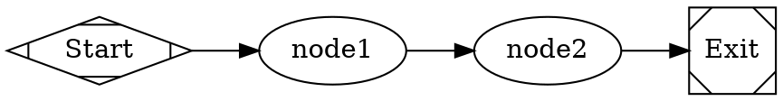

# DOT Language Reference for Arc Workflows

## Graph Structure

Every workflow is a `digraph` with a name and body. Three required elements:
1. A `goal` attribute on the graph
2. Exactly one `start` node with `shape=Mdiamond`
3. Exactly one `exit` node with `shape=Msquare`

Only `digraph` is supported (not `graph` or `strict`).



Workflows **can include loops** (unlike DAGs).

## Value Types

| Type | Syntax | Examples |
|---|---|---|
| String | Double-quoted | `"Run tests"` |
| Integer | Bare digits | `42`, `-1` |
| Float | Digits with decimal | `3.14` |
| Boolean | Keywords | `true`, `false` |
| Duration | Integer + unit | `250ms`, `30s`, `15m`, `2h`, `1d` |
| Bare string | Identifier | `claude-sonnet-4-6` |

Comments: `//` line and `/* */` block.

## Graph-Level Attributes

| Attribute | Type | Description |
|---|---|---|
| `goal` | String | Workflow objective (required) |
| `rankdir` | Identifier | Layout: `LR` or `TB` |
| `model_stylesheet` | String | CSS-like model assignment rules |
| `default_max_retry` | Integer | Default retry count for all nodes (default: 3) |
| `retry_target` | String | Default node to jump to on retry |
| `fallback_retry_target` | String | Fallback retry target |
| `default_fidelity` | String | Default fidelity for all nodes |
| `default_thread` | String | Default thread ID for all nodes |
| `max_node_visits` | Integer | Max visits per node (0 = unlimited) |
| `stall_timeout` | Duration | Timeout for stalled workflows (default: 1800s) |

## Node Types (by shape)

| Shape | Handler | Purpose |
|---|---|---|
| `Mdiamond` | start | Entry point (exactly one) |
| `Msquare` | exit | Terminal (exactly one) |
| `box` (default) | agent | Multi-turn LLM with tool access |
| `tab` | prompt | Single LLM call, no tools |
| `parallelogram` | command | Execute a shell script |
| `hexagon` | human | Human-in-the-loop decision gate |
| `diamond` | conditional | Route based on conditions |
| `component` | parallel | Fan-out to concurrent branches |
| `tripleoctagon` | parallel.fan_in | Merge parallel branch results |
| `insulator` | wait | Pause for a duration |
| `house` | stack.manager_loop | Sub-workflow orchestration |

### Agent Nodes (box, default)

Multi-turn LLM with tools (shell, read_file, write_file, grep, glob, web_search, web_fetch, edit_file).

Key attributes: `prompt`, `reasoning_effort` (low/medium/high), `max_tokens`, `fidelity`, `thread_id`, `timeout`, `backend` (api or cli), `model`, `provider`, `project_memory`.

### Prompt Nodes (tab)

Single LLM call, no tool use. Same attributes as agent but never invokes tools.

### Command Nodes (parallelogram)

Run a shell script. Attributes: `script` (shell command), `language` ("shell" or "python").

### Human Nodes (hexagon)

Pause for human choice. Edge labels define options. Supports:
- Keyboard accelerators: `[A] Approve`, `A) Approve`, `A - Approve`
- Freeform input: `freeform=true` on an edge
- Default on timeout: `human.default_choice`

### Conditional Nodes (diamond)

Route execution based on conditions. Must have multiple outgoing edges with `condition` attributes. No prompt attribute.

### Parallel Fan-Out (component)

Attributes: `join_policy` (wait_all, first_success, k_of_n(N), quorum(F)), `error_policy` (continue, fail_fast, ignore), `max_parallel` (default: 4).

### Fan-In / Merge (tripleoctagon)

Collects results from parallel branches. Results available as `parallel_results.json`.

### Wait Nodes (insulator)

Attribute: `duration` (e.g. `"30s"`, `"2m"`).

### Sub-workflow (house)

Attributes: `stack.child_dotfile`, `stack.child_dot_source`, `manager.max_cycles` (default: 1000), `manager.poll_interval` (default: 45s), `manager.stop_condition`.

## Common Node Attributes

| Attribute | Description |
|---|---|
| `label` | Display name |
| `class` | Space-separated classes for stylesheet targeting |
| `max_visits` | Max times this node can execute |
| `goal_gate` | When `true`, workflow fails if this node doesn't succeed |
| `max_retries` | Override default retry count |
| `retry_policy` | Preset: `none`, `standard`, `aggressive`, `linear`, `patient` |
| `retry_target` | Node ID to jump to on retry |
| `auto_status` | Auto-generate status updates |

## Edges and Transitions

After each node, Arc evaluates outgoing edges in priority order:
1. **Condition match** -- edges with `condition`, highest `weight` wins
2. **Preferred label** -- from human gate or LLM routing directive
3. **Suggested next** -- node suggests a next node ID
4. **Unconditional fallback** -- edges without conditions, `weight` tiebreak

Edge attributes: `label`, `condition`, `weight` (higher wins, default: 0), `fidelity`, `thread_id`, `loop_restart`.

### Condition Grammar

```
Expr       ::= OrExpr
OrExpr     ::= AndExpr ('||' AndExpr)*
AndExpr    ::= UnaryExpr ('&&' UnaryExpr)*
UnaryExpr  ::= '!' UnaryExpr | Clause
Clause     ::= Key Op Value | Key
```

Operators: `=`, `!=`, `>`, `<`, `>=`, `<=`, `contains`, `matches`.

Common patterns:
- `condition="outcome=success"` -- stage succeeded
- `condition="outcome=fail"` -- stage failed
- `condition="context.tests_passed=true"` -- check context variable

## Model Stylesheets

CSS-like syntax for assigning models to nodes:

```dot
graph [model_stylesheet="
    *        { model: claude-haiku-4-5;}
    .coding  { model: claude-sonnet-4-6;}
    #review  { model: gemini-3.1-pro-preview;}
"]
```

Selectors by specificity (low to high): `*` (universal, 0), shape name (1), `.class` (2), `#nodeid` (3). Higher specificity wins. Same specificity: last rule wins. Explicit node attributes override stylesheets.

Properties: `model`, `provider` (optional — auto-inferred from the model catalog), `reasoning_effort`, `backend`.

**Critical:** Use semicolons between properties (e.g. `model: foo; provider: bar;`).

## Variables

Define in `[vars]` section of TOML. Expanded into DOT source before parsing with `$variable` syntax. Undefined variables raise an error. Escape literal `$` with `$$`. Built-in: `$goal`.

## External Prompt Files

Reference external files with `prompt="@path/to/file.md"` (path relative to DOT file).

## Subgraphs

Group nodes visually and apply scoped defaults:

```dot
subgraph cluster_impl {
    label = "Implementation"
    node [thread_id="impl", fidelity="full"]
    plan      [label="Plan"]
    implement [label="Implement"]
}
```

When a subgraph has a `label`, it's converted to a CSS class applied to all nodes within.

## Validation Rules

Enforced at parse time:
- Exactly one start node and one exit node
- All nodes reachable from start
- No incoming edges to start, no outgoing edges from exit
- Edge targets reference existing nodes
- Condition expressions parse correctly
- Stylesheet syntax is valid
- LLM nodes have a `prompt` attribute
- `@file` references point to existing files
- Conditional (diamond) nodes have multiple outgoing edges with conditions

## Retry Policies

| Preset | Attempts | Backoff |
|---|---|---|
| `none` | 1 | No retries |
| `standard` | 5 | 5s initial, 2x exponential |
| `aggressive` | 5 | 500ms initial, 2x exponential |
| `linear` | 3 | 500ms fixed |
| `patient` | 3 | 2s initial, 3x exponential |

## Fidelity Levels

Controls how much prior context is passed to a node:

| Value | Behavior |
|---|---|
| `compact` | Structured summary (default) |
| `full` | Complete context |
| `summary:high` | Detailed summary |
| `summary:medium` | Moderate summary |
| `summary:low` | Brief summary |
| `truncate` | Minimal -- only goal and run ID |
