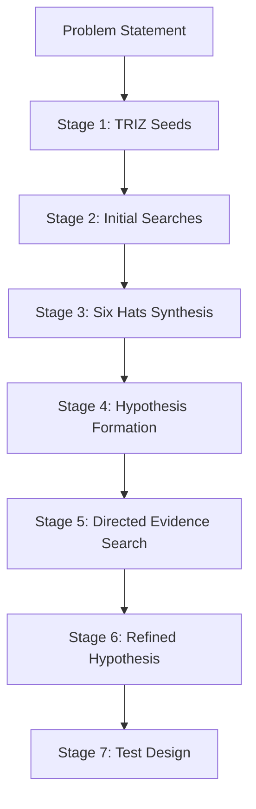

# hypothesis-forge

A seven-stage workflow that takes a raw problem statement and produces one or two
refined, evidence-backed hypotheses with concrete test designs. It is deliberately
adversarial: every hypothesis gets a dedicated contrary-evidence pass before it
survives to Stage 7.

## When to use

- You have a vague problem or research question and need to crystallize it into
  something testable
- You want to exhaust the solution space before committing to one approach
- A debugging situation where the root cause is unclear and multiple candidates exist
- Pre-work before a deep-research or causal-inference run to sharpen the question

## When NOT to use

- The answer is already known or trivially searchable — skip to `deep-research` directly
- The problem is purely implementation (use `react-agent`)
- You need a full systematic literature review — `deep-research` has better source
  tracking and saturation detection

---

## Workflow



---

## Stage 1 — TRIZ Idea Seeds

Apply all 7 TRIZ moves to the problem in sequence. Each move is a lens for generating
a distinct idea seed. Do not filter at this stage — the goal is divergence.

| TRIZ Move | What it does | Prompt |
|---|---|---|
| **Segmentation** | Split into independent parts | What if we divided this problem into smaller, independent pieces? |
| **Taking out** | Remove the troublesome part | What if we eliminated the component causing friction entirely? |
| **Local quality** | Vary properties across the object | What if different parts of the system had different properties? |
| **Asymmetry** | Break a symmetry that constrains | What if we stopped treating both sides of this as equivalent? |
| **Merging** | Combine identical/related operations | What if two separate mechanisms were unified into one? |
| **Universality** | One mechanism, multiple uses | What if this single mechanism could serve multiple purposes? |
| **Nesting** | Place inside another | What if we embedded one component inside another? |

**Output schema:**
```
seeds:
  - id: S1
    triz_move: segmentation
    idea: <one sentence>
  - id: S2
    ...
```

Produce 5–10 seeds. Keep all of them through Stage 2.

---

## Stage 2 — Initial Searches

For each seed (or the top 3 if >5 seeds were generated), run one `WebSearch` query
phrased as if you are looking for prior art or existing solutions.

- Collect 3–5 sources per seed
- Extract a 1-sentence finding per source
- Flag when a seed appears to already be a well-solved problem ("covered") vs novel

**Output schema:**
```
search_results:
  - seed_id: S1
    query: "<search query used>"
    findings:
      - source: "<title or URL>"
        finding: "<1-sentence extraction>"
    coverage: covered | partial | novel
```

---

## Stage 3 — Six Hats Synthesis

Run the Six Hats across the combined search results from Stage 2. Each hat is 2–4
sentences. The Blue hat makes a routing decision: which 1–2 seeds to carry forward.

| Hat | Focus for this stage |
|---|---|
| **White** | Facts confirmed so far; what the search evidence says |
| **Yellow** | Value, benefit, best-case path — which seeds have the strongest signal |
| **Black** | Risks, failure modes, blockers in the idea seeds |
| **Red** | Gut check — what feels contested or uncertain even if premises hold |
| **Green** | Creative alternatives the searches surfaced; unexpected pivots |
| **Blue** | Process decision: which 1–2 seeds become hypotheses and why |

The Blue hat output is the only mandatory decision gate — everything in Stage 4
flows from it.

---

## Stage 4 — Hypothesis Formation

From the Blue hat decision, form 1–3 testable hypotheses. Apply selection razors:
- **Occam's** — prefer the simplest consistent explanation
- **Hickam's** — multiple causes can coexist; don't force a single root cause
- **Hanlon's** — don't attribute to malice/complexity what simpler causes explain

**Hypothesis schema:**
```
hypotheses:
  - id: H1
    claim: "<single falsifiable sentence>"
    testable_condition: "<observable outcome that would confirm it>"
    null: "<what would falsify it>"
    prior_confidence: Low | Medium | High
    rationale: "<one-line justification for confidence level>"
```

Each claim must be falsifiable. "X is better than Y" is not — "X reduces error rate
below 5% on benchmark Z" is.

---

## Stage 5 — Directed Evidence Search

For each hypothesis, run exactly two search passes:

1. **Supporting pass** — search for evidence that the hypothesis is true
2. **Contrary pass** — search explicitly for failure cases, counter-examples, or
   research contradicting the hypothesis

```
evidence:
  - hypothesis_id: H1
    supporting:
      - source: "..."
        finding: "..."
    contrary:
      - source: "..."
        finding: "..."
    contrary_absent: true | false   # true = searched but found nothing
```

If `contrary_absent: true`, do not treat this as confirmation — note it explicitly
as "absence of evidence is not evidence of absence."

---

## Stage 6 — Refined Hypothesis

Update each hypothesis's confidence based on the evidence balance from Stage 5.
Walk the three-stage reasoning chain for each hypothesis:

1. **Deductive** — do the supporting premises entail the claim? Identify any false
   load-bearing premise that would collapse it.
2. **Inductive** — what pattern emerges across all collected evidence?
3. **Abductive** — of remaining hypotheses, which is most plausible?

Then output:

```
refined_hypotheses:
  - id: H1
    original_confidence: Low | Medium | High
    updated_confidence: Low | Medium | High
    verdict: survives | likely_false | merged_with_H2
    delta: "<what changed from prior confidence and why>"
    surviving_claim: "<updated claim if refined, else same as Stage 4>"
```

Collapse or merge hypotheses if evidence shows they reduce to the same claim.
Mark any hypothesis `likely_false` if contrary evidence dominates.

---

## Stage 7 — Test Design

For each hypothesis with `verdict: survives`, propose a concrete test:

```
test_designs:
  - hypothesis_id: H1
    validation_method: experiment | prototype | further_search | ab_test | literature_review | other
    success_criteria: "<concrete, measurable>"
    failure_modes:
      - "<false positive scenario>"
      - "<false negative scenario>"
    min_viable_test: "<the smallest action that could produce signal>"
```

The `min_viable_test` is the most important field — it is the next action.

---

## Failure Modes

| Failure | Cause | Recovery |
|---|---|---|
| All seeds are "covered" at Stage 2 | Problem is well-solved | Re-run Stage 1 with TRIZ moves applied to the *why it's hard to adopt existing solutions* angle |
| Six Hats Blue hat produces >2 seeds | Too broad a problem | Narrow the problem statement and restart |
| No contrary evidence found at Stage 5 | Query too narrow or problem genuinely novel | Broaden the contrary search to adjacent failure modes |
| All hypotheses collapse at Stage 6 | Insufficient evidence or over-specified claims | Return to Stage 4, relax the claim granularity |
| Stage 7 min_viable_test is "run a full experiment" | Claim is too big | Break the claim into sub-claims and re-run from Stage 4 |

---

## See Also

- `reasoning/SKILL.md` — TRIZ heuristics reference, Six Hats table, reasoning chain
- `deep-research/SKILL.md` — full web research protocol with source tracking and saturation detection; use when Stage 5 needs exhaustive multi-source corroboration
- `causal-inference/SKILL.md` — if the refined hypothesis is causal in nature, hand off the test design here
- `AGENTS.md` (Operating Contract section) — hypothesis schema and anti-sycophancy contract
