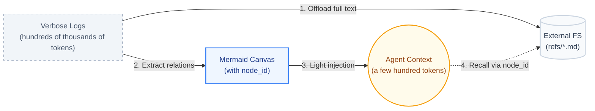

<div align="center">


### Agents remember,Humans innovate.

[](https://www.npmjs.com/package/@tencentdb-agent-memory/memory-tencentdb)
[](./LICENSE)
[](https://nodejs.org/)
[](https://github.com/openclaw/openclaw)
[](https://hermes-agent.nousresearch.com/docs/)
[](https://discord.gg/kDtHb5RW2)

[Highlights](#-highlights) · [Overview](#overview) · [Core Technology](#core-technology-reject-flat-storage-embrace-layering-and-symbolization) · [Features](#-features) · [Quick Start](#quick-start)

<div align="center">

[**English**](./README.md) · [简体中文](./README_CN.md)

</div>


</div>

---

## ✨ Highlights

> **TencentDB Agent Memory = symbolic short-term memory + layered long-term memory.**
>
> - **Symbolic short-term memory** offloads heavy tool logs and condenses them into compact Mermaid symbols, cutting token usage and improving task success.
> - **Layered long-term memory** distills fragmented conversations into structured personas and scenes, instead of flat vector piles.

When integrated with OpenClaw, it cuts token usage by up to **61.38%**, improves pass rate by **51.52%** (relative), and raises PersonaMem accuracy from **48%** to **76%**.

| Memory Capability | Benchmark | OpenClaw Success | With Plugin | Relative Δ | OpenClaw Tokens | With Plugin Tokens | Relative Δ |
| :--- | :--- | :---: | :---: | :---: | :---: | :---: | :---: |
| **Short-term** | WideSearch | 33% | **50%** | **+51.52%** | 221.31M | **85.64M** | **−61.38%** |
| **Short-term** | SWE-bench | 58.4% | **64.2%** | **+9.93%** | 3474.1M | **2375.4M** | **−33.09%** |
| **Short-term** | AA-LCR | 44.0% | **47.5%** | **+7.95%** | 112.0M | **77.3M** | **−30.98%** |
| **Long-term** | PersonaMem | 48% | **76%** | **+59%** | — | — | — |

> These results are measured over continuous long-horizon sessions, not isolated turns. For example, SWE-bench runs 50 consecutive tasks per session to simulate the context-accumulation pressure of real-world long-horizon agents.

---

## Overview

**Memory is not about hoarding everything in the AI — it is about sparing humans from having to repeat themselves.**

In practice, we constantly re-explain the same SOPs, project background, tool conventions, and output formats to the Agent. Such information should not require repetition, nor should it be indiscriminately dumped into the context.

TencentDB Agent Memory helps the Agent learn your workflows, retain task context, and reuse past experience. We reject both brute-force history accumulation and irreversible lossy summarization. Instead, we design memory as a layered system: **symbolic memory** for in-task information overload, and **memory layering** for cross-session experience.

> **Let the Agent remember what should be remembered, so people can focus on judgment, creation, and work that truly matters.**

---

## Core Technology: Reject Flat Storage, Embrace Layering and Symbolization

Our architecture rests on two pillars: **memory layering** and **symbolic memory**. Together they ensure Agents do not merely "remember more", but "reason better".

### 1. Memory Layering: Progressive Disclosure with Heterogeneous Storage

Traditional memory systems shred data into fragments and dump them into a flat vector store. Recall degenerates into a blind search across disconnected fragments, with no macro-level guidance.

Whether it is long-term knowledge, short-term tasks, or future skill capabilities, memory should never be flat — both its formation and its recall must be hierarchical. TencentDB Agent Memory adopts **layering** as its unified architectural paradigm:

*   **Short-term context layering.** The bottom layer archives raw tool outputs (`refs/*.md`); the middle layer extracts step-level summaries (`jsonl`); the top layer condenses state into a lightweight Mermaid canvas. The Agent only needs to attend to the top-layer structure in context, and drills down to the lower layers via `node_id` when an error occurs.
*   **Long-term personalization layering.** In place of flat logs, we build a semantic pyramid: **L0 Conversation** (raw dialogue) → **L1 Atom** (atomic facts) → **L2 Scenario** (scene blocks) → **L3 Persona** (user profile). The Persona layer carries day-to-day preferences; the system drills down to Atoms only when details matter.
*   **Skill generation layering.** Layering also applies to actions. The middle layer derives common solution patterns (**Scenario**) from bottom-layer execution traces (**Conversation**), and the top layer distills reusable Skills or standard SOPs (**Persona**).

<p align="center">
  
</p>

**Heterogeneous storage and progressive disclosure.** A dual-layer storage strategy underpins this architecture. The bottom layer (facts, logs, traces) is persisted in databases for robust full-text retrieval; the top layer (personas, scenes, canvases) is stored as human-readable Markdown files for high information density and white-box inspection. **Lower layers preserve evidence; upper layers preserve structure.**

**Full traceability and lossless recovery.** Compression often sacrifices traceability. TencentDB Agent Memory avoids irreversible compression by maintaining a deterministic path from high-level abstractions back to ground-truth evidence. Whether it is an offloaded error log or a distilled user preference, the system guarantees a complete drill-down path: "top-layer symbol (Persona / canvas) → mid-layer index (Scenario / jsonl) → bottom-layer raw text (L0 Conversation / refs)".

<div align="center">
  
</div>

### 2. Symbolic Memory: Maximum Semantics in Minimum Symbols (Mermaid Canvas)

In long tasks, the largest token consumers are verbose intermediate logs (search results, code, error traces). To address this, we combine **context offloading** with **symbolic memory**:

*   **Mermaid symbol graph.** Instead of verbose prose or flat JSON, we encode task state transitions in high-density Mermaid syntax — precise enough for LLMs to parse, concise enough for humans to read.
*   **History offloading.** Full tool logs are offloaded to external files; only a lightweight Mermaid task map remains in context.
*   **`node_id` tracing.** The Agent reasons over the symbol graph; to verify a detail, it greps for the `node_id` and instantly retrieves the full raw text — cutting token cost while preserving full traceability.



---

## Quick Start
## 🎬 Demos

<table align="center">
  <tr align="center" valign="middle">
    <td width="50%" valign="middle">
      <video src="https://github.com/user-attachments/assets/09c64a2c-9997-42c0-90a3-a15e250cfa43" controls="controls" muted="muted" style="max-width: 100%;"></video>
    </td>
    <td width="50%" valign="middle">
      <video src="https://github.com/user-attachments/assets/69045512-e75f-4c84-99dd-52ffa6e9e317" controls="controls" muted="muted" style="max-width: 100%;"></video>
    </td>
  </tr>
  <tr align="center" valign="top">
    <td>
      <em>OpenClaw × Agent Memory</em>
    </td>
    <td>
      <em>Hermes × Agent Memory</em>
    </td>
  </tr>
</table>

---


### 1. OpenClaw
### 1.1 Install the plugin

```bash
openclaw plugins install @tencentdb-agent-memory/memory-tencentdb
openclaw gateway restart
```

### 1.2 Zero-config to enable

Defaults to a local `SQLite + sqlite-vec` backend.

```jsonc
// ~/.openclaw/openclaw.json
{
  "memory-tencentdb": {
    "enabled": true
  }
}
```

Once enabled, TencentDB Agent Memory automatically handles conversation capture, memory extraction, scene aggregation, persona generation, and recall before the next turn.

### 1.3 Enable short-term compression (optional, requires version ≥ 0.3.4)

```jsonc
{
  "memory-tencentdb": {
    "config": {
      "offload": {
        "enabled": true
      }
    }
  }
}
```

#### Step 1 — Register the slot in your plugin config

Add the `slots` field so OpenClaw routes context-offload requests to this plugin:

```jsonc
{
  "plugins": {
    "slots": {
      "contextEngine": "openclaw-context-offload"
    }
  }
}
```

#### Step 2 — Apply the runtime patch

For the best results, run the patch script below. It hooks `after-tool-call` messages so they can be offloaded and recovered correctly:

```bash
bash scripts/openclaw-after-tool-call-messages.patch.sh
```

> 💡 The patch only needs to be applied once per OpenClaw installation. After upgrading OpenClaw, re-run the script to re-apply.


### 2. Hermes (Docker, requires version ≥ 0.3.4)

In addition to OpenClaw, this plugin also supports [Hermes](https://github.com/NousResearch/hermes-agent) Agent. You can launch a memory-enabled Hermes with a single command:

```bash
# ============ Configuration Parameters ============
# MODEL_API_KEY    LLM API key (required) — replace with your own credential
# MODEL_BASE_URL   LLM endpoint, defaults to Tencent Cloud LKE (Large Model Knowledge Engine)
# MODEL_NAME       Model name, defaults to DeepSeek-V3.2
# MODEL_PROVIDER   Provider type: "custom" works for any OpenAI-compatible endpoint

MODEL_API_KEY="your-api-key"
MODEL_BASE_URL="https://api.lkeap.cloud.tencent.com/v1"
MODEL_NAME="deepseek-v3.2"
MODEL_PROVIDER="custom"

# ============ docker run Flags ============
# -d                          Run container in detached (background) mode
# --name hermes-memory        Container name, for later docker exec / logs / stop
# --restart unless-stopped    Auto-restart on crash or host reboot
# -p 8420:8420                Host port ↔ container port (Hermes Gateway)
# -e MODEL_*                  Inject the config parameters above as env vars
# -v hermes_data:/opt/data    Persist memory data to a named volume (survives restart)

# Enter the Docker build directory (already cloned the repo and at the repo root)
cd docker/opensource

# Build
docker build -f Dockerfile.hermes -t hermes-memory .

# Run
docker run -d \
  --name hermes-memory \
  --restart unless-stopped \
  -p 8420:8420 \
  -e MODEL_API_KEY="your-api-key" \
  -e MODEL_BASE_URL="https://api.lkeap.cloud.tencent.com/v1" \
  -e MODEL_NAME="deepseek-v3.2" \
  -e MODEL_PROVIDER="custom" \
  -v hermes_data:/opt/data \
  hermes-memory

# Verify the Gateway
curl http://localhost:8420/health

# Enter the Hermes interactive shell
docker exec -it hermes-memory hermes
```

> The image ships with Tencent Cloud DeepSeek-V3.2 as the default. If you use this model, omit `MODEL_BASE_URL` / `MODEL_NAME` / `MODEL_PROVIDER` and pass only `MODEL_API_KEY`.

---


## 🔧 Configurable Parameters

**Every field has a sensible default — it runs with zero configuration.** When you want to tune, peel back the layers based on how deep you go.

<details>
<summary><b>🟢 Level 1 · Daily tuning</b> (covers 90% of use cases)</summary>

| Field | Default | Description |
| :--- | :--- | :--- |
| `storeBackend` | `"sqlite"` | Storage backend: `sqlite` |
| `recall.strategy` | `"hybrid"` | Recall strategy: `keyword` / `embedding` / `hybrid` (RRF fusion, recommended) |
| `recall.maxResults` | `5` | Number of items returned per recall |
| `pipeline.everyNConversations` | `5` | Trigger an L1 memory extraction every N turns |
| `extraction.maxMemoriesPerSession` | `20` | Max memories extracted per L1 pass |
| `persona.triggerEveryN` | `50` | Generate the user persona every N new memories |
| `offload.enabled` | `false` | Whether to enable short-term compression |

</details>

<details>
<summary><b>🟡 Level 2 · Advanced tuning</b> (long task / long session)</summary>

| Field | Default | Description |
| :--- | :--- | :--- |
| `pipeline.enableWarmup` | `true` | Warm-up: a new session triggers from turn 1, doubling each time up to N (1→2→4→…) |
| `pipeline.l1IdleTimeoutSeconds` | `600` | Trigger L1 after the user has been idle for this many seconds |
| `pipeline.l2MinIntervalSeconds` | `900` | Minimum interval between two L2 passes within the same session |
| `recall.timeoutMs` | `5000` | Recall timeout; on timeout, skip injection without blocking the conversation |
| `extraction.enableDedup` | `true` | L1 vector dedup / conflict detection |
| `capture.excludeAgents` | `[]` | Glob patterns to exclude specific agents (e.g. `bench-judge-*`) |
| `capture.l0l1RetentionDays` | `0` | Local retention days for L0 / L1 files; `0` = never clean up |
| `offload.mildOffloadRatio` | `0.5` | Mild compression trigger ratio (of context window) |
| `offload.aggressiveCompressRatio` | `0.85` | Aggressive compression trigger ratio |
| `offload.mmdMaxTokenRatio` | `0.2` | Token budget ratio for MMD injection |
| `bm25.language` | `"zh"` | Tokenizer language: `zh` (jieba) / `en` |

</details>

<details>
<summary><b>🔴 Level 3 · Full parameter reference</b> (ops / custom models / remote embedding)</summary>

For all fields, types, and constraints see [`openclaw.plugin.json`](./openclaw.plugin.json)。

- `embedding.*` — remote embedding service (OpenAI-compatible API)
- `llm.*` — standalone LLM mode (bypass OpenClaw's built-in model and run L1/L2/L3 with a designated API)
- `offload.backendUrl / backendApiKey` — offload the L1/L1.5/L2/L4 flow to a backend service
- `report.*` — metrics reporting

</details>

---

## 🤔 Features

### 1. Macro Personas + Micro Facts: A Unified Drill-Down Mechanism

The biggest risk in compression is saving tokens at the cost of losing the evidence. TencentDB Agent Memory therefore does not collapse history into an irreversible summary — it preserves a clear path from high-level abstraction back to ground-truth evidence.

| Question type | First look at | Drill down to |
| :--- | :--- | :--- |
| Daily preferences, voice, long-term goals | L3 Persona / L2 Scenario | L1 Atom / L0 Conversation when facts are needed |
| Specific facts, dates, project details | L1 Atom / L0 Conversation | Widen the time range, or fall back to semantic recall when results are sparse |
| Continuing a long-running task | Active Mermaid task canvas | Check the JSONL when the summary lacks detail, then `refs/*.md` for raw text |
| Resuming a historical task | Metadata task entry | Open the Mermaid canvas → locate the `node_id` → trace `result_ref` |

The upper layers carry judgment and direction; the lower layers carry evidence and precision. Short-term compression and long-term memory form a single closed loop: **collapsible and expandable, abstract yet auditable.**

### 2. White-Box Debuggability: Memory Is Not a Black Box

Most memory systems fall short here: when recall is wrong, all you see is a list of vector scores, with no way to tell where things went wrong. TencentDB Agent Memory keeps the key intermediates as readable files:

- L2 Scenario blocks are plain Markdown — open them and inspect.
- L3 Persona lives in `persona.md` and traces back to the Scenarios that produced it.
- Short-term task canvases are Mermaid — readable by both humans and Agents.
- Raw payloads, summaries, and nodes are linked by `result_ref` and `node_id`.

Debugging no longer means probing an opaque database — it becomes a deterministic walk along the chain "Persona → Scenario → Atom → Conversation" until the root cause surfaces.

**All of these layered memory artifacts live under `~/.openclaw/memory-tdai/` — feel free to open the directory and inspect each layer for yourself.**

### 3. Production-Ready Engineering: Not a Demo

| Capability | Description |
| :--- | :--- |
| OpenClaw plugin | Automatically captures, extracts, and recalls memory once installed |
| Hermes Gateway adapter | `TdaiCore + HostAdapter`, decoupled from the host framework |
| Local backend | `SQLite + sqlite-vec`, ready to use out of the box |
| Hybrid retrieval | BM25 + vector + RRF — supports both keyword and semantic recall |
| Agent tools | `tdai_memory_search` / `tdai_conversation_search` |

---

## Documentation

| Document | Contents |
| :--- | :--- |
| [`scripts/README.memory-tencentdb-ctl.md`](./scripts/README.memory-tencentdb-ctl.md) | Operations & management tooling |
| [`CHANGELOG.md`](./CHANGELOG.md) | Release notes and version history |
| [`openclaw.plugin.json`](./openclaw.plugin.json) | OpenClaw plugin manifest and configuration schema |

---

## Community & Contributing

We welcome every kind of contribution — bug reports, feature ideas, doc fixes, benchmark reproductions, ecosystem integrations, or a Pull Request. Agent memory is far from a solved problem, and we'd love to figure it out together.

- 🐞 **Found a bug or have a question?** Open an issue at [GitHub Issues](https://github.com/Tencent/TencentDB-Agent-Memory/issues) — we respond within 24 hours.
- 💡 **Have an idea to share?** Start a thread in [GitHub Discussions](https://github.com/Tencent/TencentDB-Agent-Memory/discussions).
- 🛠️ **Want to contribute code?** Please read [CONTRIBUTING.md](./CONTRIBUTING.md) first.
- 💬 **Want to chat with us?** Join our [Discord community](https://discord.gg/kDtHb5RW2) and talk to the early developers directly.

---

## Roadmap

- [x] Long-term personalized memory (L0 → L3)
- [x] Short-term context compression (Context Offload + Mermaid canvas)
- [x] Local SQLite backend and Tencent Cloud Vector Database (TCVDB) backend
- [x] OpenClaw plugin and Hermes Gateway integration
- [ ] Portable memory: cross-Agent / cross-framework / cross-device import, export, and live migration
- [ ] Automatic Skill generation
- [ ] Visual debugging and memory observability dashboard

---

<table>
  <tr>
    <td width="68%">
      <b>If TencentDB Agent Memory has been useful to you, please give the project a ⭐ to support us.</b><br />
      For any suggestions, feel free to open an issue and start the discussion.
    </td>
    <td width="32%" align="right">
      
    </td>
  </tr>
</table>

[MIT](./LICENSE) © TencentDB Agent Memory Team
