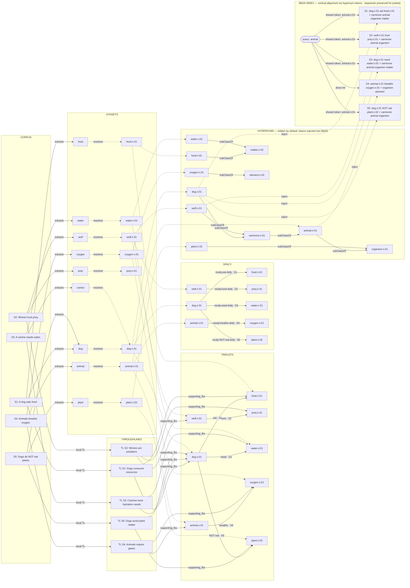

```mermaid
graph LR

    subgraph CORPUS
        s1["S1: A dog eats food."]
        s2["S2: Wolves hunt prey."]
        s3["S3: A canine needs water."]
        s4["S4: Animals breathe oxygen."]
        s5["S5: Dogs do NOT eat plants."]
    end

    subgraph SYNSETS
        surf_dog["dog"]       -.->|resolves| syn_dog["dog.n.01"]
        surf_canine["canine"] -.->|resolves| syn_dog
        surf_wolf["wolf"]     -.->|resolves| syn_wolf["wolf.n.01"]
        surf_animal["animal"] -.->|resolves| syn_animal["animal.n.01"]
        surf_food["food"]     -.->|resolves| syn_food["food.n.01"]
        surf_prey["prey"]     -.->|resolves| syn_prey["prey.n.01"]
        surf_water["water"]   -.->|resolves| syn_water["water.n.01"]
        surf_oxygen["oxygen"] -.->|resolves| syn_oxygen["oxygen.n.01"]
        surf_plant["plant"]   -.->|resolves| syn_plant["plant.n.02"]
    end

    subgraph TRIPLETS
        tr_dog["dog.n.01"]       -->|"eat · S1"| tr_food["food.n.01"]
        tr_wolf["wolf.n.01"]     -->|"hunt · S2"| tr_prey["prey.n.01"]
        tr_dog                   -->|"need · S3"| tr_water["water.n.01"]
        tr_animal["animal.n.01"] -->|"breathe · S4"| tr_oxygen["oxygen.n.01"]
        tr_dog                   -->|"NOT eat · S5"| tr_plant["plant.n.02"]
    end

    subgraph SPACY
        sp_dog["dog.n.01"]
        sp_wolf["wolf.n.01"]
        sp_animal["animal.n.01"]
        sp_dog    -->|"nsubj-eat-dobj · S1"| sp_food["food.n.01"]
        sp_wolf   -->|"nsubj-hunt-dobj · S2"| sp_prey["prey.n.01"]
        sp_dog    -->|"nsubj-need-dobj · S3"| sp_water["water.n.01"]
        sp_animal -->|"nsubj-breathe-dobj · S4"| sp_oxygen["oxygen.n.01"]
        sp_dog    -->|"nsubj-NOT-eat-dobj · S5"| sp_plant["plant.n.02"]
    end

    subgraph HYPERNYMS["HYPERNYMS — hidden by default; tokens injected into BM25"]
        h_dog["dog.n.01"]       -->|subClassOf| h_carn["carnivore.n.01"]
        h_wolf["wolf.n.01"]     -->|subClassOf| h_carn
        h_carn                  -->|subClassOf| h_animal["animal.n.01"]
        h_animal                -->|subClassOf| h_org["organism.n.01"]
        h_food["food.n.01"]     -->|subClassOf| h_matter["matter.n.03"]
        h_water["water.n.01"]   -->|subClassOf| h_matter
        h_oxygen["oxygen.n.01"] -->|subClassOf| h_element["element.n.02"]
        h_plant["plant.n.02"]   -->|subClassOf| h_org
    end

    subgraph BM25["BM25 INDEX — vertical alignment via hypernym tokens · stopwords preserved for polarity"]
        bm25_s1["S1: dog.n.01 eat food.n.01 + carnivore animal organism matter"]
        bm25_s2["S2: wolf.n.01 hunt prey.n.01 + carnivore animal organism"]
        bm25_s3["S3: dog.n.01 need water.n.01 + carnivore animal organism matter"]
        bm25_s4["S4: animal.n.01 breathe oxygen.n.01 + organism element"]
        bm25_s5["S5: dog.n.01 NOT eat plant.n.02 + carnivore animal organism"]
        q_animal(["query: animal"])
        q_animal -->|"shared token: animal.n.01"| bm25_s1
        q_animal -->|"shared token: animal.n.01"| bm25_s2
        q_animal -->|"shared token: animal.n.01"| bm25_s3
        q_animal -->|"direct hit"| bm25_s4
        q_animal -->|"shared token: animal.n.01"| bm25_s5
    end

    subgraph THROUGHLINES
        tl_s1["TL S1: Dogs consume resources"]
        tl_s2["TL S2: Wolves are predators"]
        tl_s3["TL S3: Canines have hydration needs"]
        tl_s4["TL S4: Animals require gases"]
        tl_s5["TL S5: Dogs avoid plant matter"]
        tl_s1 -->|supporting_fks| tr_dog
        tl_s1 -->|supporting_fks| tr_food
        tl_s2 -->|supporting_fks| tr_wolf
        tl_s2 -->|supporting_fks| tr_prey
        tl_s3 -->|supporting_fks| tr_dog
        tl_s3 -->|supporting_fks| tr_water
        tl_s4 -->|supporting_fks| tr_animal
        tl_s4 -->|supporting_fks| tr_oxygen
        tl_s5 -->|supporting_fks| tr_dog
        tl_s5 -->|supporting_fks| tr_plant
    end

    s1 -->|extracts| surf_dog
    s1 -->|extracts| surf_food
    s2 -->|extracts| surf_wolf
    s2 -->|extracts| surf_prey
    s3 -->|extracts| surf_canine
    s3 -->|extracts| surf_water
    s4 -->|extracts| surf_animal
    s4 -->|extracts| surf_oxygen
    s5 -->|extracts| surf_dog
    s5 -->|extracts| surf_plant

    s1 -->|local TL| tl_s1
    s2 -->|local TL| tl_s2
    s3 -->|local TL| tl_s3
    s4 -->|local TL| tl_s4
    s5 -->|local TL| tl_s5

    syn_dog    -.-> tr_dog
    syn_dog    -.-> sp_dog
    syn_dog    -.-> h_dog
    syn_wolf   -.-> tr_wolf
    syn_wolf   -.-> sp_wolf
    syn_wolf   -.-> h_wolf
    syn_animal -.-> tr_animal
    syn_animal -.-> sp_animal
    syn_animal -.-> h_animal
    syn_food   -.-> tr_food
    syn_food   -.-> h_food
    syn_water  -.-> tr_water
    syn_water  -.-> h_water
    syn_oxygen -.-> tr_oxygen
    syn_oxygen -.-> h_oxygen
    syn_plant  -.-> tr_plant
    syn_plant  -.-> h_plant

    h_dog    -.->|inject| bm25_s1
    h_wolf   -.->|inject| bm25_s2
    h_dog    -.->|inject| bm25_s3
    h_animal -.->|inject| bm25_s4
    h_dog    -.->|inject| bm25_s5
```